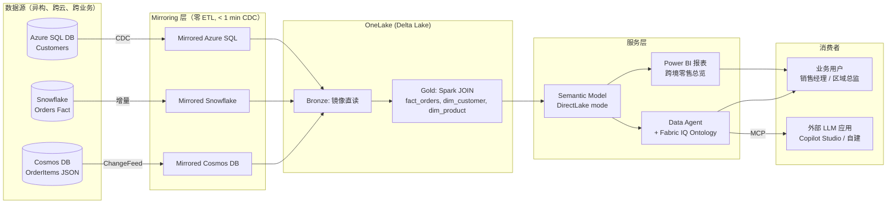
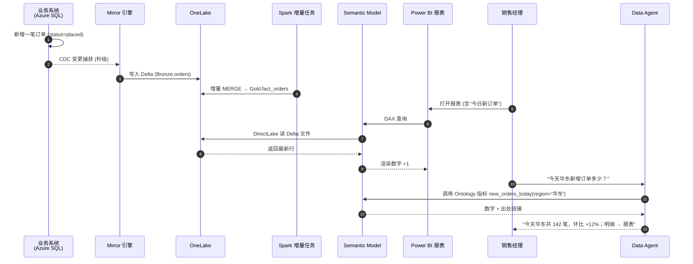

# 01 · 架构设计

## 1. 全景架构图



---

## 2. 组件职责

| 组件 | 职责 | Fabric 工件类型 |
|------|------|----------------|
| Mirrored Azure SQL | 持续把 Customers 表镜像进 OneLake | Mirrored Database |
| Mirrored Snowflake | 持续把 Orders 事实表镜像进 OneLake | Mirrored Database |
| Mirrored Cosmos DB | 持续把 OrderItems JSON 镜像进 OneLake | Mirrored Database |
| Bronze Lakehouse | 镜像数据的"原样"区，只读引用 | Lakehouse + Shortcut |
| Gold Lakehouse | Spark JOIN/清洗后的星型模型 | Lakehouse + Spark Notebook |
| Semantic Model | DirectLake 模式的语义模型，承载 DAX 指标 | Semantic Model |
| Power BI 报表 | 销售经理看的仪表板 | Report |
| Fabric IQ Ontology | 把业务概念（订单、退货率）落到语义层 | Ontology |
| Data Agent | 自然语言入口 | Data Agent |
| MCP Endpoint | 让外部 Copilot/自建 LLM 调用 Agent | API |

---

## 3. 时序图（一次端到端业务事件）



---

## 4. 数据流细节

### 4.1 Bronze → Gold 转换（Notebook）

```python
# 仅示意，不在此 demo 范围执行
from pyspark.sql import functions as F

orders = spark.read.format("delta").load(
    "abfss://<ws>@onelake.dfs.fabric.microsoft.com/<MirrorSnowflake>/Tables/ORDERS"
)
customers = spark.read.format("delta").load(
    "abfss://<ws>@onelake.dfs.fabric.microsoft.com/<MirrorSQL>/Tables/Customers"
)
items = spark.read.format("delta").load(
    "abfss://<ws>@onelake.dfs.fabric.microsoft.com/<MirrorCosmos>/Tables/order_items"
)

fact_orders = (
    orders.alias("o")
    .join(customers.select("customer_id", "customer_name", "region", "tier").alias("c"),
          "customer_id", "left")
    .withColumn("order_date", F.to_date("placed_at"))
)

(fact_orders.write.format("delta")
    .mode("overwrite")
    .option("overwriteSchema", "true")
    .saveAsTable("gold.fact_orders"))
```

### 4.2 DirectLake 模型组件

```text
gold.fact_orders   (事实表)
   |── customer_id ──→ gold.dim_customer
   |── sku          ──→ gold.dim_product
   |── order_date   ──→ gold.dim_date (DAX 自动生成)

Measures:
   - Total Revenue       = SUM(fact_orders[amount])
   - Return Rate         = DIVIDE(COUNT(returned), COUNT(orders))
   - Revenue YoY         = CALCULATE([Total Revenue], SAMEPERIODLASTYEAR(dim_date[Date]))
```

### 4.3 Ontology 关键定义（节选）

```yaml
concepts:
  Customer:
    region: customer_region  # 华东/华南/华北/华西
  Order:
    placed_at: order_date
    status: order_status
  Product:
    category: category_name  # 咖啡机/水杯/...

metrics:
  return_rate:
    formula: count(Order where status='returned') / count(Order)
    grain: [region, category, period(D/W/M/Q/Y)]
```

---

## 5. 关键设计决策

| 决策 | 选择 | 原因 |
|------|------|------|
| 是否中间层做 Bronze | 是（薄一层 Shortcut） | 隔离 Mirror 直访的命名风险，方便 Gold 重命名 |
| Gold 是 Lakehouse 还是 Warehouse | **Lakehouse** | Spark JOIN 灵活、便于 ML 复用 |
| Semantic Model 模式 | **DirectLake** | 零数据延迟、无需调度刷新 |
| Agent 用 Lakehouse SQL 还是 Semantic Model | **优先 Semantic Model** | DAX 经过优化最快，且使用业务指标 |
| Ontology 必须有吗 | **是** | 没本体 Agent 命中率 60-70%，有本体 95%+ |
| Cosmos JSON 是否打平 | **打平** | 让 BI 用户能直查 items.sku、items.qty |

---

## 6. 与 [W6 Mirroring 深度课](https://github.com/turbo998/microsoft-fabric-learning-plan/blob/main/deep-dives/w6-mirroring-deep-dive.md) 和 [W7 Data Agents 深度课](https://github.com/turbo998/microsoft-fabric-learning-plan/blob/main/deep-dives/w7-data-agents-deep-dive.md) 的关系

本 demo 是这两个深度课的"综合实战题" —— 把 W6 的 3 种 Mirror 和 W7 的 Agent + IQ 串起来。建议先做完两课再上手本 demo。

---

→ 准备硬件/账号：[02-setup-prereqs.md](02-setup-prereqs.md)
